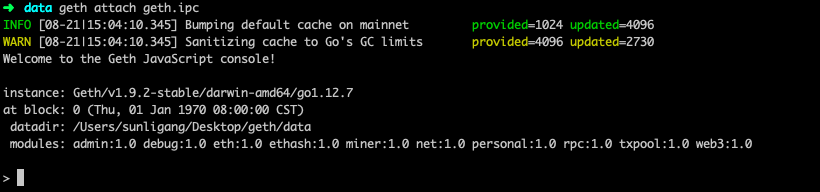

# geth 使用方式

## 安装geth

macOs

``` shell
brew update

brew upgrade

brew tap ethereum/ethereum

brew install ethereum

geth version //进行验证
```

centos

``` shell
git clone https://github.com/ethereum/go-ethereum
cd go-ethereum
make geth
build/bin/geth
```

注意需要找到bin目录运行geth，或者将 geth 命令放入环境变量中

## 编写genesis.json文件

```json
{
    "config": {
        "chainId": 15,
        "homesteadBlock": 0,
        "eip155Block": 0,
        "eip158Block": 0
    },
    "difficulty": "1",
    "gasLimit": "210",
    "alloc": {
    }
}
```

## 初始化

``` shell
geth --datadir ~/geth/data init ~/geth/genesis.json
```

## 启动

``` shell
geth --datadir ~/geth/data
```

## 交互命令行连接

``` shell
# 找到 data 目录下的 geth.ipc
geth attach ~/geth/data/geth.ipc
```



### 生成账户

``` shell
personal.newAccount("123456")
"0x4c2e1e2df0626e2a56e543cfd4d366c739ca94a0"
```

### 开启挖矿

``` shell
> miner.setEtherbase(eth.accounts[0])
true
> miner.start()
null
> eth.blockNumber
0
> eth.blockNumber
1
> eth.blockNumber
```

**注意：**genesis.json中的difficulty不可设置太大，否则可能导致一直无法出现新的区块。

### 账户解锁

注:
1.9.2的geth需要设置 `--allow-insecure-unlock`参数

在部署合约或者调用合约（写区块操作）时，需要解锁账户（coinbase账户），在本系统中，使用coinbase账户进行调用合约。

``` shell
personal.unlockAccount("0x318a1986cffc2ea7b39eb1375f41bead79ce58f3","123456")
```

#### geth 启动参数解释

--rpc: 运行rpc调用，用于部署

--rpcapi：运行的rpc类型 value（personal,db,eth,net,web3）

--rpccorsdomain：允许跨域 value（“*”，表示所有的都允许）

--allow-insecure-unlock 运行通过 HTTP 解锁账户

``` shell

geth --datadir ~/geth/data --rpcapi personal,db,eth,net,web3 --rpc --rpccorsdomain "*" --allow-insecure-unlock
```
